

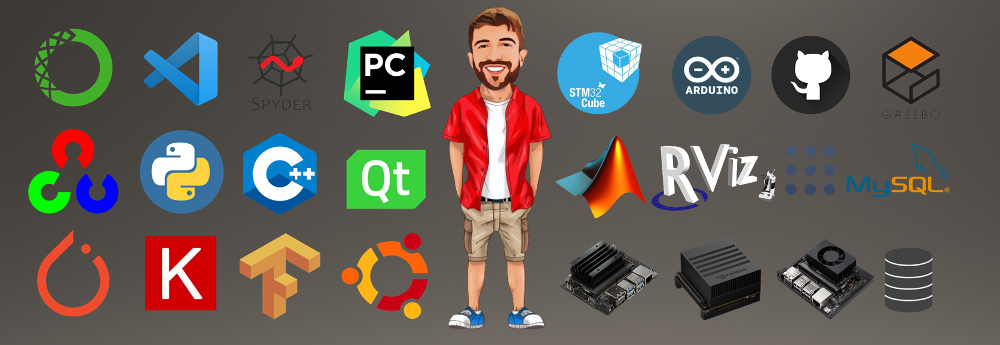

  

#### *I am Bilal from Turkey and am a mechatronics engineering (PhD).*  
- 👨‍🏫 I completed my doctoral education at Sakarya University of Applied Sciences, Mechatronics Engineering in 2023.
- 🧑‍💻 In my doctoral thesis, I worked on path planning algorithms of mobile robots. I used PSO and chaotic systems in the path planning algorithm.
- ⚡️ I am currently improving myself in the fields of image processing, artificial intelligence and ROS.

****************************************************************************************************
****************************************************************************************************
****************************************************************************************************
# MY PROJECTS:

## 🚀 Traffic Control with YOLOv8

    

****************************************************************************************************
****************************************************************************************************
****************************************************************************************************

## 🚀 Traffic Control with YOLOv8

    

****************************************************************************************************
****************************************************************************************************
****************************************************************************************************

## 🚀 Object Detection with YOLOv4 (first) & YOLOv8 (second)

    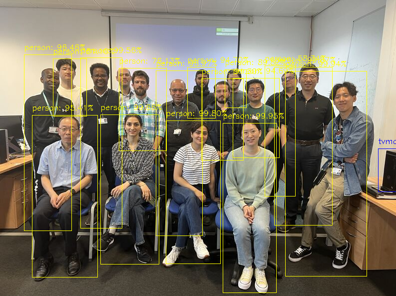
    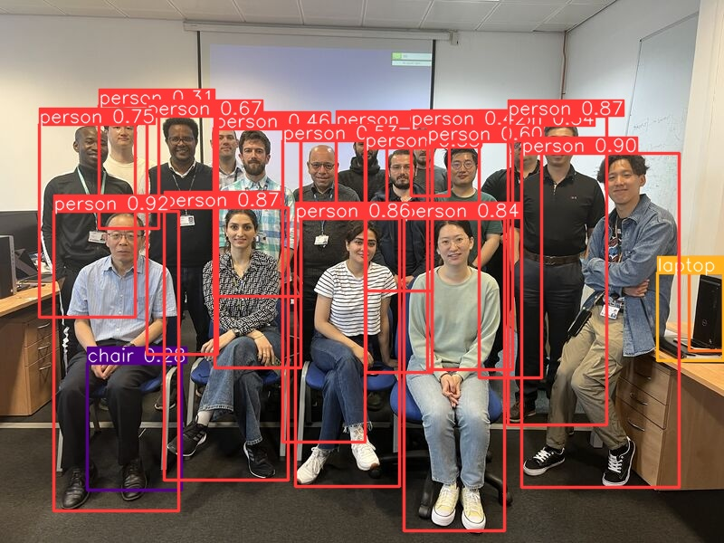

****************************************************************************************************
****************************************************************************************************
****************************************************************************************************

## 🚀 Detection of Animal Species with YoloV8 (first) & OpenCV DNN (Second) 
### (Image Classification) 

    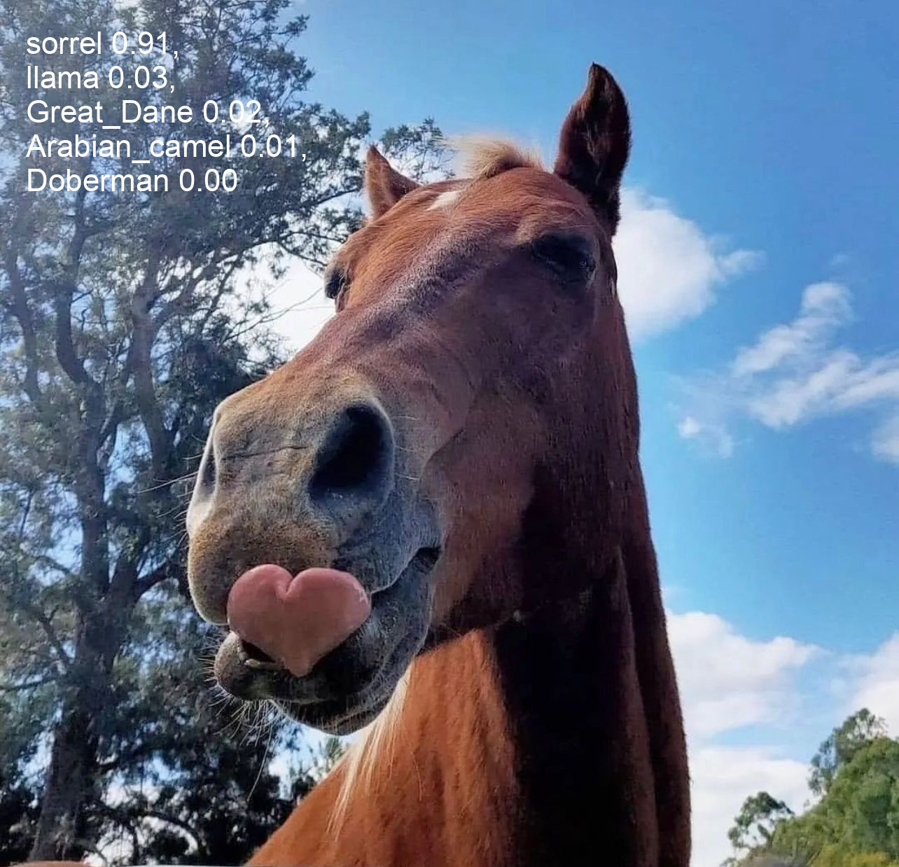
    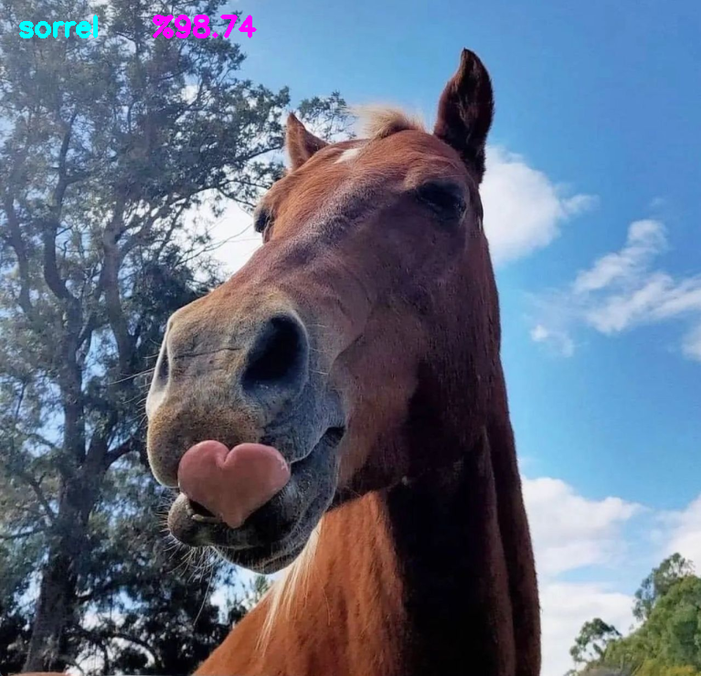

****************************************************************************************************
****************************************************************************************************
****************************************************************************************************

## 🚀 Face mesh with Mediapipe

    

****************************************************************************************************
****************************************************************************************************
****************************************************************************************************

## 🚀 Depth Estimation with OpenCV DNN

    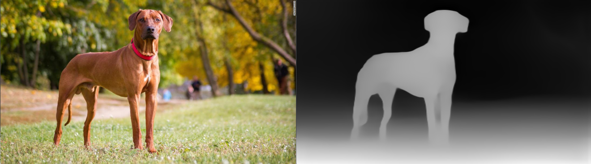

****************************************************************************************************
****************************************************************************************************
****************************************************************************************************

## 🚀 Detection of Fire with Keras

    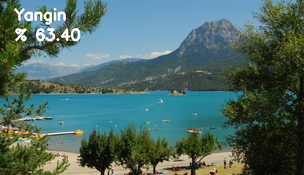
    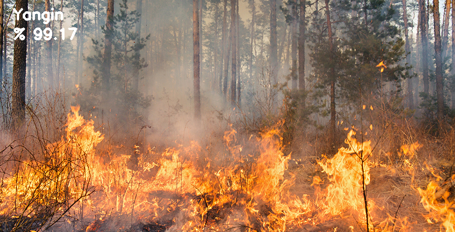

****************************************************************************************************
****************************************************************************************************
****************************************************************************************************

## 🚀 My AMR Platform 

    

****************************************************************************************************
****************************************************************************************************
****************************************************************************************************

## 🚀 Gmapping 

    

****************************************************************************************************
****************************************************************************************************
****************************************************************************************************

## 🚀 Path Planning 

    

****************************************************************************************************
****************************************************************************************************
****************************************************************************************************

## 🚀 ZED2 Stereo Cam

    

****************************************************************************************************
****************************************************************************************************
****************************************************************************************************

## 🚀 MENU CONTROL
* Menuler arası geçişi sağlamak için temel bir çalışma
* `parentWidget()`, `findChildren()`, `findChild()`, `sender()` gibi yapıların kullanımına dair temel yapılar içerir
- 🚀 Thanks [Ramazan GUL](https://github.com/blackepars)  😊

    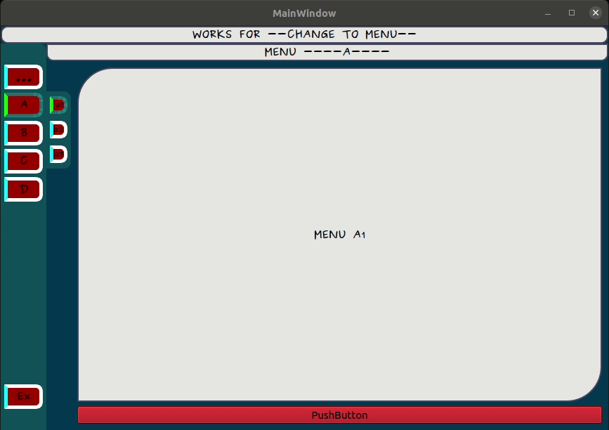

****************************************************************************************************
****************************************************************************************************
****************************************************************************************************

## 🚀 IP SCANNER
- 🚀 Thanks [Onur YOZCU](https://github.com/onuryozcu)  😊

    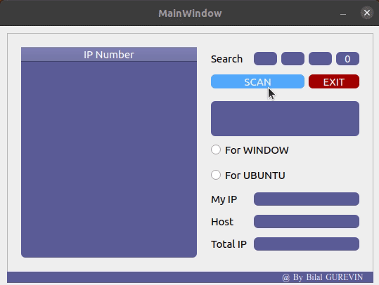

****************************************************************************************************
****************************************************************************************************
****************************************************************************************************

## 🚀 LEVEL STATUS CONTROL & THREAD
* İki farklı `thread` bulunmaktadır
* `start` ve `stop` butonları ile threadler başlatılıyor.
* farklı thread ler farklı hızlarda kontrol edilbilmektedir

    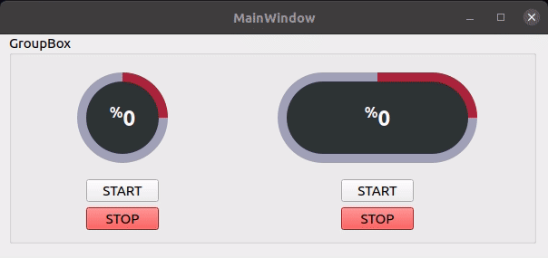

****************************************************************************************************
****************************************************************************************************
****************************************************************************************************

## 🚀 BATTARY STATUS CONTROL

    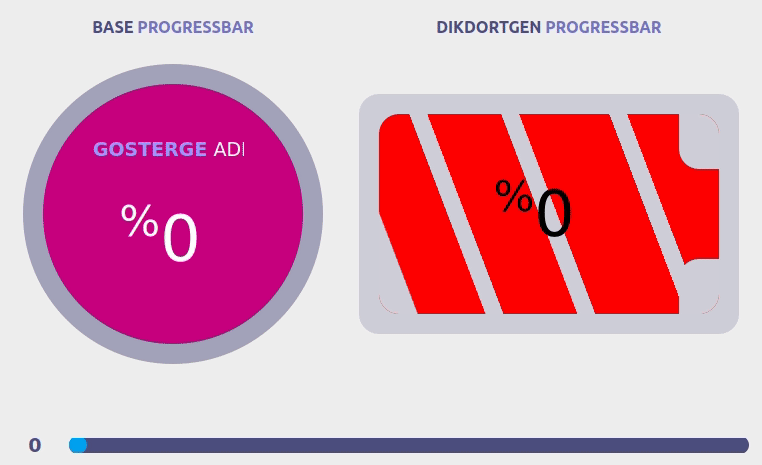

****************************************************************************************************
****************************************************************************************************
****************************************************************************************************

## 🚀 TIMER LED CONTROL
* `time` kütüphanesini kullanarak `timer kurma`, `timer başlatma` ve `timer durdurma` çalışmasını içerir
* ekrandan girilen timer süresine göre ledler kontrol edilmekte

    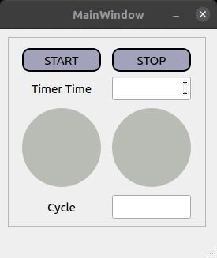

****************************************************************************************************
****************************************************************************************************
****************************************************************************************************

## 🚀 STATUS ANIMATION
* `time` kütüphanesini kullanarak `timer kurma`, `timer başlatma` ve `timer durdurma` çalışmasını içerir
* belirlenen timer süresinde oluşturulan animasyon sayesinde sistemin aktifliği takip edilebilmekte

    

****************************************************************************************************
****************************************************************************************************
****************************************************************************************************

## 🚀 THREADING PROCEDURE
* `QThread` kütüphanesini kullanarak `class ThreadClass(QtCore.QThread):` isminde bir thread class oluşturuldu
* Class içerisinde `signal` oluşturma ve `emit` etme özelliğini içerir

    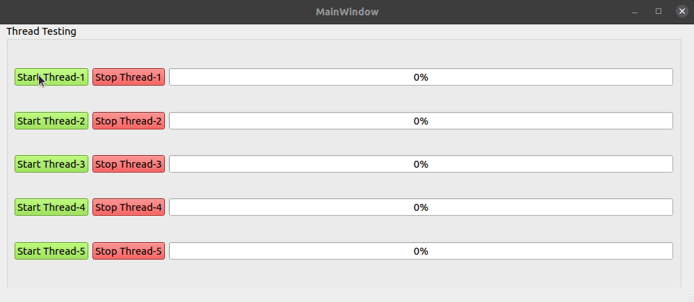

****************************************************************************************************
****************************************************************************************************
****************************************************************************************************

## 🚀 TOGGLE BUTTON
* `self.findChildren` ve `self.findChild` hakkında genel bir kod yapısı örneği içerir
* sol tarafdaki 4 adet buton ile klasik bir toggle çalışması yapılmıştır
* sağ tarafdaki 3 adet buton ile toggle buton sayesinde bulunduğu yerdeki bir üst widget renklendirilerek kontrol edilmiştir
* sol tarafta görülen komut satırında da, obje isimleri tespit edilerek alt alta yazdırılmıştır. 

    

****************************************************************************************************
****************************************************************************************************
****************************************************************************************************

<h1 align="left">Connect with me</h1>

  
  

<h1 align="left">Github Stats</h1>

  

  
   

<h1 align="left">Recent Blog Posts  </h1>

  
 
