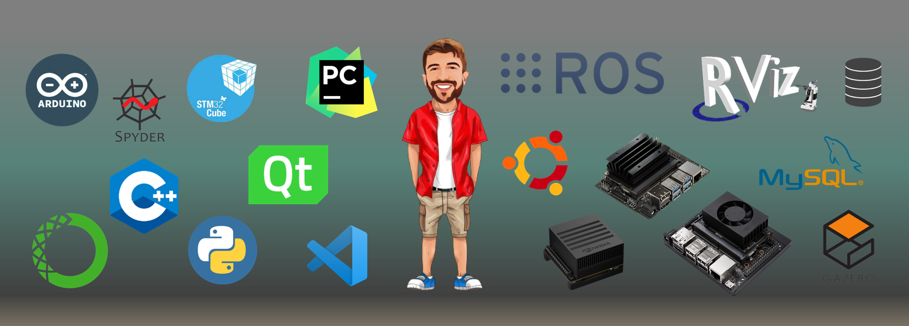

  

#### *I am Bilal from Turkey and am a PhD student at mechatronics engineering.*  
  
- 🧑‍💻 I have been working on ROS based path planning. I have been realizating my works on Autonomous Mobile Robot (AMR) that mine designed.  
- ⚡️ I’m currently learning ROS, Python, QtDesigner, MySQL.

<h1 align="left">Languages and Tools</h1>

 
 
 
 
 
 
 
 
 
 
 

****************************************************************************************************
****************************************************************************************************
****************************************************************************************************
# MY PROJECTS:

## 🚀 Gazebo 

    

****************************************************************************************************
****************************************************************************************************
****************************************************************************************************

## 🚀 Gmapping 

    

****************************************************************************************************
****************************************************************************************************
****************************************************************************************************

## 🚀 Path Planning 

    

## 🚀 MENU CONTROL
* Menuler arası geçişi sağlamak için temel bir çalışma
* `parentWidget()`, `findChildren()`, `findChild()`, `sender()` gibi yapıların kullanımına dair temel yapılar içerir
- 🚀 Thanks [Ramazan GUL](https://github.com/blackepars)  😊

    

****************************************************************************************************
****************************************************************************************************
****************************************************************************************************

## 🚀 IP SCANNER
- 🚀 Thanks [Onur YOZCU](https://github.com/onuryozcu)  😊

    

****************************************************************************************************
****************************************************************************************************
****************************************************************************************************

## 🚀 LEVEL STATUS CONTROL & THREAD
* İki farklı `thread` bulunmaktadır
* `start` ve `stop` butonları ile threadler başlatılıyor.
* farklı thread ler farklı hızlarda kontrol edilbilmektedir

    

****************************************************************************************************
****************************************************************************************************
****************************************************************************************************

## 🚀 BATTARY STATUS CONTROL

    

****************************************************************************************************
****************************************************************************************************
****************************************************************************************************

## 🚀 TIMER LED CONTROL
* `time` kütüphanesini kullanarak `timer kurma`, `timer başlatma` ve `timer durdurma` çalışmasını içerir
* ekrandan girilen timer süresine göre ledler kontrol edilmekte

    

****************************************************************************************************
****************************************************************************************************
****************************************************************************************************

## 🚀 STATUS ANIMATION
* `time` kütüphanesini kullanarak `timer kurma`, `timer başlatma` ve `timer durdurma` çalışmasını içerir
* belirlenen timer süresinde oluşturulan animasyon sayesinde sistemin aktifliği takip edilebilmekte

    

****************************************************************************************************
****************************************************************************************************
****************************************************************************************************

## 🚀 THREADING PROCEDURE
* `QThread` kütüphanesini kullanarak `class ThreadClass(QtCore.QThread):` isminde bir thread class oluşturuldu
* Class içerisinde `signal` oluşturma ve `emit` etme özelliğini içerir

    

****************************************************************************************************
****************************************************************************************************
****************************************************************************************************

## 🚀 TOGGLE BUTTON
* `self.findChildren` ve `self.findChild` hakkında genel bir kod yapısı örneği içerir
* sol tarafdaki 4 adet buton ile klasik bir toggle çalışması yapılmıştır
* sağ tarafdaki 3 adet buton ile toggle buton sayesinde bulunduğu yerdeki bir üst widget renklendirilerek kontrol edilmiştir
* sol tarafta görülen komut satırında da, obje isimleri tespit edilerek alt alta yazdırılmıştır. 

    

****************************************************************************************************
****************************************************************************************************
****************************************************************************************************

<h1 align="left">Connect with me</h1>

  
  

<h1 align="left">Github Stats</h1>

  

  
   
  

<h1 align="left">Recent Blog Posts  </h1>

  
 
